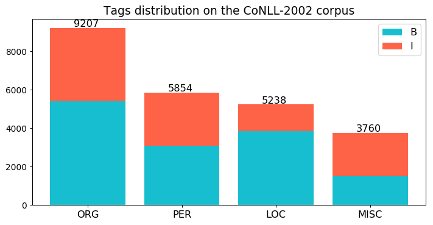

# spanish-ner
Experiments from NER task in Spanish language using CoNLL-2002 and Mexican news datasets

### CoNLL-2002 data set

The CoNLL-2002 data set has four classes under tagging schema IOB (Inside/Outside/Beginning).

No.| Class | Schema | Description
---|-------|-|-----------
1  | ORG   | B-ORG, I-ORG | Organizations names
2  | PER   | B-PER, I-PER | People names
3  | LOC   | B-LOC, I-LOC | Location names
4  | MISC  | B-MISC, I-MISC | Miscellaneous

#### Tags distribution using IOB schema

Parts of data from the corpus CoNLL-2002.

No.| Partition | Sentences O | Sentences S | Tokens | Tags
---|-------|------|------|------|---
1  | Test A| 1915 | 2177 | 9646 | 8
2  | Test B| 1517 | 1848 | 9086 | 8
3  | Train| 8323 | 9947 | 26099 | 8
4  | Ensemble| 11755 | 13972 | 31405 | 8

CoNLL-2002 ELmo embeddings [Download](http://148.228.13.30/spanish-ner/data/conll-2002-spanish.full.elmo.tar.gz)

In headings, **Sentences O** are the original sentences length. **Sentences S** were splitted to length 50 (tokens).

#### Sentence histogram

***

### Mx-news data set

#### Tags distribution using IOB schema

Parts of data from the corpus Mx-news.

No.| Partition | Sentences O | Sentences S | Tokens | Tags
---|---------|------|------|------|---
1  | Split I | 1295 | 1666 | 7628 | 63
2  | Split II | 1295 | 1677 | 7726 | 63
3  | Split III | 1297 | 1661 | 7664 | 63
4  | Ensemble | 3888 | 5004 | 13273 | 65

Mx-news ELMo embeddings [Download](http://148.228.13.30/spanish-ner/data/mx-news.spanish.full.elmo.tar.gz)

#### Sentence histogram

