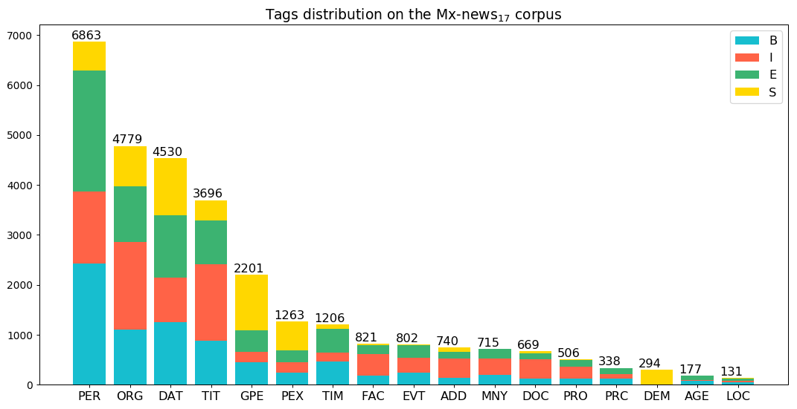

# Probabilistic vs Deep Learning based approaches for narrow domain NER in Spanish
Experiments from NER task in Spanish language using two corpora: CoNLL-2002 and Mexican news

## Data

### CoNLL-2002 dataset

The CoNLL-2002 dataset is in the language Spanish and it has four classes under tagging schema IOB (Inside/Outside/Beginning).

No.| Class | IOB Schema     | Description
---|-------|----------------|:-----------
1  | ORG   | B-ORG, I-ORG   | Organizations names
2  | PER   | B-PER, I-PER   | People names
3  | LOC   | B-LOC, I-LOC   | Location names
4  | MISC  | B-MISC, I-MISC | Miscellaneous

The CoNLL-2002 dataset was split into four partitions.

No.| Partition | Original    | Split       | Tokens | Tags
---|-----------|------------:|------------:|-------:|---
1  | Test A    | 1915        | 2177        | 9646   | 8
2  | Test B    | 1517        | 1848        | 9086   | 8
3  | Train     | 8323        | 9947        | 26099  | 8
4  | Ensemble  | 11755       | 13972       | 31405  | 8

In headings, **Original** are the original sentences length. **Split** were splitted to length 50 (tokens).

### CoNLL-2002 dataset distribution

CoNLL-2002 dataset is labeled under IOB (Inside/Beginning/Out) schema

### CoNLL-2002 Sentences histogram

***

### Mx-news dataset

The Mx-news dataset was built on the political news domain using 250 documents, it is in the language Spanish and it has seventeen classes. One annotator used tagging schema IOBES (Inside/Outside/Beginning/End/Single) to labeled this corpus.

No.| Class | IOB Schema                 | Description
---|-------|----------------------------|:------------------------------------------------
1  |  PER  | B-PER, I-PER, E-PER, S-PER | People names, aliases and abbreviations
2  |  ORG  | B-ORG, I-ORG, E-ORG, S-ORG | Organizations, institutions
3  |  DAT  | B-DAT, I-DAT, E-DAT, S-DAT | Dates on different formats
4  |  TIT  | B-TIT, I-TIT, E-TIT, S-TIT | Title or position of persons
5  |  GPE  | B-GPE, I-GPE, E-GPE, S-GPE | Country names, states, cities, municipalities
6  |  PEX  | B-PEX, I-PEX, E-PEX, S-PEX | Political party names, aliases and abbreviations
7  |  TIM  | B-TIM, I-TIM, E-TIM, S-TIM | Time expresions
8  |  FAC  | B-FAC, I-FAC, E-FAC, S-FAC | Facility names
9  |  EVT  | B-EVT, I-EVT, E-EVT, S-EVT | Event names
10 |  ADD  | B-ADD, I-ADD, E-ADD, S-ADD | Addresses expressions, URLs and Twitter users
11 |  MNY  | B-MNY, I-MNY, E-MNY, ----- | Monetary amounts
12 |  DOC  | B-DOC, I-DOC, E-DOC, S-DOC | Documents, laws, rules
13 |  PRO  | B-PRO, I-PRO, E-PRO, S-PRO | Product names, brands, application names
14 |  PRC  | B-PRC, I-PRC, E-PRC, ----- | Percentage expressions
15 |  DEM  | B-DEM, -----, E-DEM, S-DEM | Geographical or racial origin of people
16 |  AGE  | B-AGE, I-AGE, E-AGE, ----- | People age
17 |  LOC  | B-LOC, I-LOC, E-LOC, S-LOC | Locations about regions, rivers, lakes

The Mx-news dataset was split into four partitions.

No.| Partition | Original    | Split       | Tokens | Tags
---|-----------|------------:|------------:|-------:|---
1  | Split I   | 1295        | 1666        | 7628   | 63
2  | Split II  | 1295        | 1677        | 7726   | 63
3  | Split III | 1297        | 1661        | 7664   | 63
4  | Ensemble  | 3888        | 5004        | 13273  | 65

In headings, **Original** are the original sentences length. **Split** were splitted to length 50 (tokens).

### Mx-news dataset distribution (seventeen classes)

Mx-news dataset was labeled under IOBES (Inside/Out/Beginning/End/Single) schema.

### Mx-news dataset distribution (seventeen classes)

Mx-news dataset was reduced to four classes: ORG, PER, LOC, MISC (the fourteen left) is labeled under IOB (Inside/Beginning/Out) schema.

### Mx-news Sentences histogram

***

### ELMo word embeddings

The ELMo word embeddings were trained using [elmoformanylangs](https://github.com/HIT-SCIR/ELMoForManyLangs) Python library.

[Download](http://148.228.13.30/spanish-ner/data/full.conll-2002.elmo.tar.gz) CoNLL-2002 ELmo embeddings

[Download](http://148.228.13.30/spanish-ner/data/full.mx-news.elmo.tar.gz) Mx-news ELMo embeddings

## Requirements

The Python libraries used are:

* elmoformanylangs==0.0.2
* graphviz==0.10.1
* Keras==2.2.4
* Keras-Applications==1.0.7
* keras-contrib==2.0.8
* Keras-Preprocessing==1.0.9
* matplotlib==3.0.3
* numpy==1.16.2
* seqeval==0.0.10
* scikit-learn==0.20.3
* sklearn-crfsuite==0.3.6
* tensorflow==1.13.1

